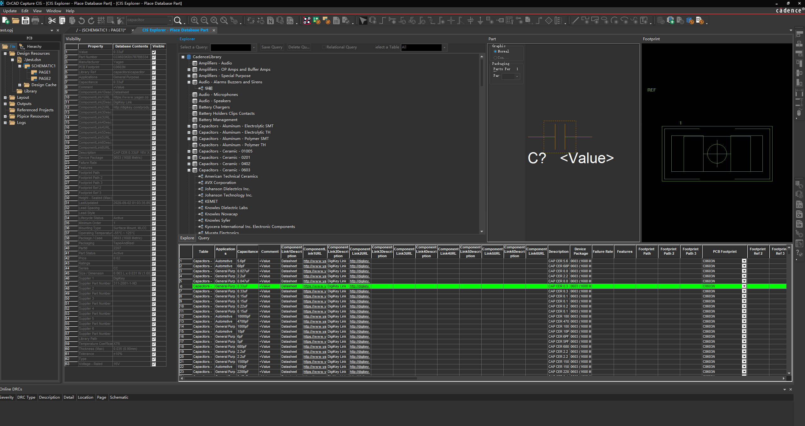

# CadenceLibrary
Cadence Allegro &amp;&amp; Capture CIS Database Library



####脚本说明
- evn.sh
  
  evn.sh 用于生成 Capture CIS 和 Allegro 所需的环境路径, 将生成的Capture.txt文件内容添加或者替换到 Capture.ini 相应设置。evn.txt 文件内容添加或者替换到 evn 相应设置。Capture.ini 和 evn 都位于 Cadence 用户数据路径下(默认是 SPB_Data\cdssetup\OrCAD_Capture\<version>, SPB_Data\pcbenv)
- creatDBC.sh
  
  creatDBC.sh 用于生成CIS系统所需的数据库配置文件, 输出文件为 allTableDBC.DBC。输入必要参数有两个, 第一个是描述 table 字段属性的CSV文件, csv文件第一个字段必须是表名, 一个 Table 一行, 第二个是描述每个Table 中的某个字段对应 CIS 的 Part Type 属性, csv文件第一个字段必须是表名, 一个 table占一行。默认可以使用一下参数:
  
  ``` sh

  ./creatDBC.sh LibraryManagement/table.csv LibraryManagement/table_part_type.csv

  ```

